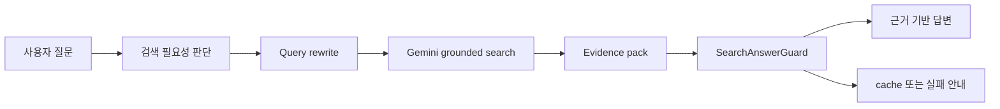

# Gemini 검색 리트리버 전환 기록

[한국어](./GEMINI_SEARCH_RETRIEVER_INTEGRATION_PLAN.md) · [English](./en/gemini-search-retriever-integration-plan.md)

업데이트 기준: 2026-05-21

이 문서는 최신 사용법이 아니라 Gemini grounding 검색 전환 당시의 설계 기록이다. 현재 운영 기준은 [사용법](./사용법_빠른시작.md)과 [도구 통합 패널](./도구_통합_패널_사용_가이드.md)을 우선한다.

## 목표

- 최신 정보 질문은 grounding 검색을 우선 사용한다.
- 검색 결과는 evidence pack으로 정리한다.
- 답변 guard가 근거 부족, 날짜 불일치, count-lock 실패를 잡는다.
- 실패 시 cache fallback이나 정직한 실패 메시지를 사용한다.

## 현재 흐름

## 남은 판단 기준

검색 품질은 프롬프트만 늘린다고 좋아지지 않는다. 좋은 검색은 질문 재작성, 출처 선택, evidence 압축, freshness 판단, 답변 guard가 함께 움직여야 한다.
