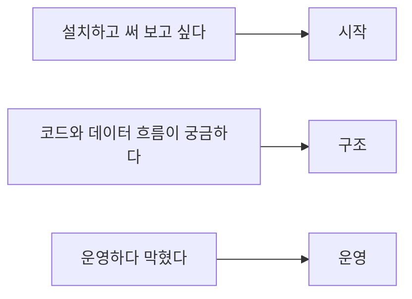

# omnux 문서

[한국어](./README.md) · [English](./en/README.md)

업데이트 기준: 2026-09-12

목적에 맞는 문서를 빠르게 찾을 수 있도록 주제별로 구성했습니다. v1.0.6 기준으로 Tauri 데스크톱 앱(6개 영역 18개 화면), .NET 9 미들웨어, 7개 LLM provider, 외부 접속 제한 모드, 크로스 플랫폼(macOS/Linux/Windows) 환경 구성을 포괄합니다.

## 시작

| 문서 | 언제 보나 | English |
|---|---|---|
| [5분 시작](./QUICKSTART.md) | setup부터 첫 실행까지 순서대로 할 때 | [Open](./en/quickstart.md) |
| [사용법](./사용법_빠른시작.md) | 어느 화면에서 무엇을 누르는지 알고 싶을 때 | [Open](./en/usage.md) |
| [텔레그램 봇](./텔레그램_봇_가이드.md) | 밖에서 봇으로 omnux를 사용할 때 | [Open](./en/telegram-bot.md) |

## 구조

| 문서 | 다루는 내용 | English |
|---|---|---|
| [아키텍처](./아키텍처_흐름.md) | 요청이 지나는 경로, 명령 라우팅, 안전 경계 | [Open](./en/architecture.md) |
| [기술 스택](./기술스택_정리.md) | 언어별 책임, 원본 위치, 새 런타임 승인 기준 | [Open](./en/tech-stack.md) |
| [디렉터리 가이드](./디렉터리_가이드.md) | 어느 폴더에 무엇이 있는지 | [Open](./en/directory-guide.md) |
| [AGENTS와 스킬](./AGENTS_AND_SKILLS.md) | 지침 파일을 읽는 순서, 스킬 활성화 규칙 | [Open](./en/agents-and-skills.md) |

## 기능

| 문서 | 다루는 내용 | English |
|---|---|---|
| [계획과 Task Graph](./PLANNING_AND_TASKS.md) | 작업 화면의 계획 생성·승인·실행과 복구 | [Open](./en/planning-and-tasks.md) |
| [노트와 이어보기](./NOTEBOOKS_AND_HANDOFF.md) | 작업 기록 네 종류와 handoff 문서 | [Open](./en/notebooks-and-handoff.md) |
| [Safe Refactor](./SAFE_REFACTORING.md) | 미리 보기 세 가지 방식과 적용 직전 재확인 | [Open](./en/safe-refactoring.md) |
| [NVIDIA NIM](./nvidia-nim-provider.md) | `nvidia` provider의 기본값과 환경변수 | [Open](./en/nvidia-nim-provider.md) |

## 운영

| 문서 | 언제 보나 | English |
|---|---|---|
| [환경변수와 상태 파일](./환경변수_및_상태파일.md) | `OMNUX_*` 변수와 저장 위치를 확인할 때 | [Open](./en/environment-and-state.md) |
| [Doctor](./DOCTOR.md) | 무언가 안 될 때 먼저 돌려 볼 진단 | [Open](./en/doctor.md) |
| [검증 가이드](./검증_가이드.md) | 기능을 바꾼 뒤 무엇을 돌려야 하는지 | [Open](./en/validation.md) |
| [토큰과 메모리 초기화](./토큰_메모리_초기화_가이드.md) | 답변이 옛 문맥에 끌려갈 때 | [Open](./en/token-memory-reset.md) |
| [정리 기준](./CLEANUP.md) | 지워도 되는 것과 안 되는 것을 가를 때 | [Open](./en/cleanup.md) |
| [수동 회귀 체크리스트](./OMNUX_실환경_수동_최종회귀_체크리스트.md) | 릴리스 직전 사람이 직접 눌러 볼 때 | [Open](./en/manual-regression-checklist.md) |

## 저장소에 없는 문서

2026-09-07 전면 리뉴얼 과정의 조사·감사·마이그레이션 기록은 `docs/RENEWAL_2026-09-07.md` 및 `docs/renewal/`에 아카이빙되어 있습니다. 리뉴얼 작업 당시의 상태 기록이므로 현재 최신 동작과 차이가 있을 수 있습니다.

## 읽는 법

- 사용 가이드는 실제 UI에 드러난 인터랙션과 동작을 정확히 기술합니다.
- 구조 가이드는 모듈별 책임과 데이터 전달 흐름을 기술합니다.
- 환경변수 이름, 파일 경로, CLI 명령어는 소스 코드와 동일한 정규 표기를 준수합니다.
- 검증 문서는 통과한 테스트와 미검증 범위를 명확히 분리해 기록합니다.
- 군더더기 수식어를 배제하고 담백한 기술 문체로 서술합니다.
- 한국어 문서와 영문 문서는 상호 동일한 섹션 구조를 유지합니다.

화면 스크린샷은 `node scripts/audit-all-screens.mjs`로 `output/playwright/audit/all/`에 생성합니다. `assets/readme/social-preview.png`는 GitHub 소셜 카드 이미지입니다.
