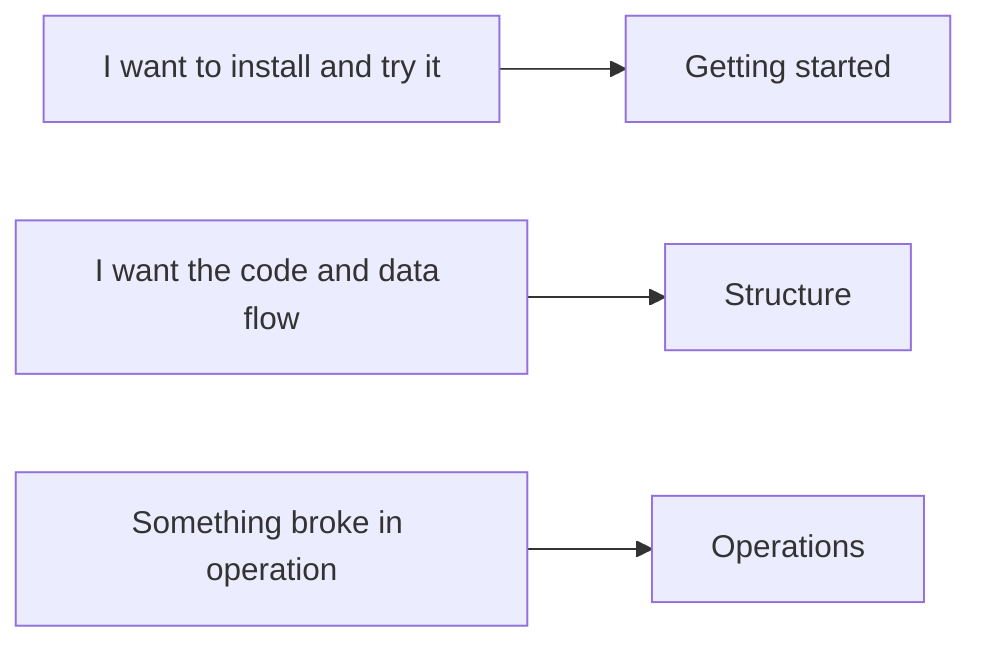

# omnux Documentation

[한국어](../README.md) · [English](./README.md)

Updated: 2026-09-12

The documents are grouped by subject and describe v1.0.6: the Tauri desktop app with 6 areas and 18 screens, the .NET 9 middleware, 7 providers, remote limited mode, and setup on macOS, Linux, and Windows.

## Getting started

| Document | Read it when | 한국어 |
|---|---|---|
| [Quickstart](./quickstart.md) | You are going from setup to first run | [열기](../QUICKSTART.md) |
| [Usage](./usage.md) | You want to know what to press on each screen | [열기](../사용법_빠른시작.md) |
| [Telegram bot](./telegram-bot.md) | You use the bot to control omnux while away | [열기](../텔레그램_봇_가이드.md) |

## Structure

| Document | What it covers | 한국어 |
|---|---|---|
| [Architecture](./architecture.md) | The path a request takes, command routing, safety boundaries | [열기](../아키텍처_흐름.md) |
| [Tech stack](./tech-stack.md) | Per-language responsibility, source locations, new runtime approval | [열기](../기술스택_정리.md) |
| [Directory guide](./directory-guide.md) | What lives in which folder | [열기](../디렉터리_가이드.md) |
| [AGENTS and skills](./agents-and-skills.md) | Instruction file read order, skill activation rules | [열기](../AGENTS_AND_SKILLS.md) |

## Features

| Document | What it covers | 한국어 |
|---|---|---|
| [Planning and task graphs](./planning-and-tasks.md) | Creating, approving, running, and recovering plans on the Tasks screen | [열기](../PLANNING_AND_TASKS.md) |
| [Notes and handoff](./notebooks-and-handoff.md) | The four record types and the handoff document | [열기](../NOTEBOOKS_AND_HANDOFF.md) |
| [Safe Refactor](./safe-refactoring.md) | Three preview methods and the re-check before apply | [열기](../SAFE_REFACTORING.md) |
| [NVIDIA NIM](./nvidia-nim-provider.md) | Defaults and variables for the `nvidia` provider | [열기](../nvidia-nim-provider.md) |

## Operations

| Document | Read it when | 한국어 |
|---|---|---|
| [Environment and state files](./environment-and-state.md) | You check an `OMNUX_*` variable or a storage path | [열기](../환경변수_및_상태파일.md) |
| [Doctor](./doctor.md) | Something does not work and you want a diagnosis first | [열기](../DOCTOR.md) |
| [Validation guide](./validation.md) | You changed a feature and need to know what to run | [열기](../검증_가이드.md) |
| [Token and memory reset](./token-memory-reset.md) | Answers keep drifting toward old context | [열기](../토큰_메모리_초기화_가이드.md) |
| [Cleanup](./cleanup.md) | You are separating what is safe to delete from what is not | [열기](../CLEANUP.md) |
| [Manual regression checklist](./manual-regression-checklist.md) | You are clicking through the app before a release | [열기](../OMNUX_실환경_수동_최종회귀_체크리스트.md) |

## Not in the repository

Survey, audit, and execution records from the renewal that started 2026-09-07 live in `docs/RENEWAL_2026-09-07.md` and `docs/renewal/`. They preserve the state at the time of the work and can differ from current behavior, so they are excluded by `.gitignore` and are not present in a cloned repository.

## How these are written

- Usage documents describe only what is on screen today.
- Structure documents describe responsibility and how data moves.
- Variable names, file paths, and command strings stay exactly as the code spells them.
- Validation documents separate what passed from what is not checked yet.
- Plain sentences. No marketing adjectives, no closing summary paragraph, no negative parallelism.
- A section that exists in the Korean document exists in the English one too.

Capture screenshots with `node scripts/audit-all-screens.mjs` into `output/playwright/audit/all/`. `assets/readme/social-preview.png` is the GitHub social card.
