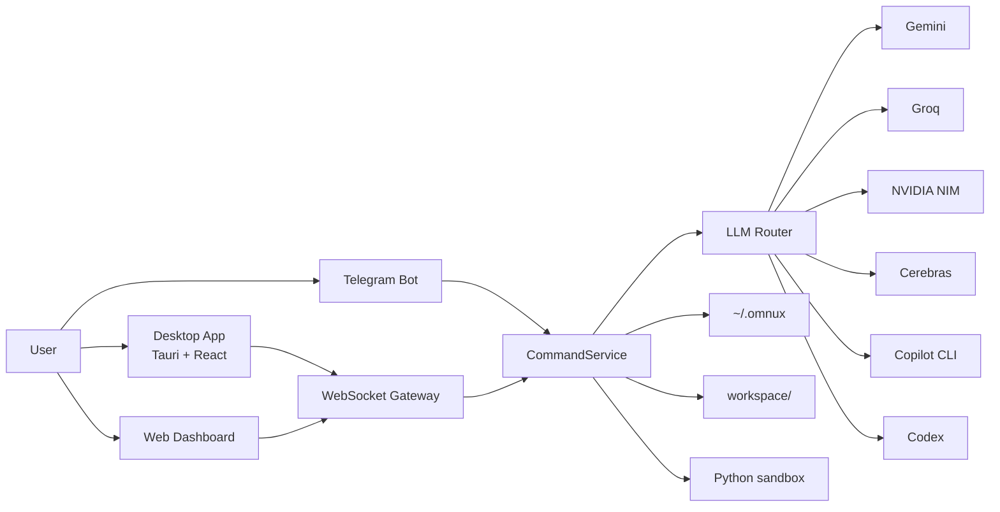

# omnux Architecture

[한국어](../아키텍처_흐름.md) · [English](./architecture.md)

Updated: 2026-06-05

omnux ties small components together with WebSocket and file-based state stores. The key insight is that the desktop app, web dashboard, and Telegram bot all pass through the same command layer — they don't behave as separate products.



## Components

| Location | Tech | Role |
|---|---|---|
| `apps/omnux-middleware` | .NET 9, AOT | WebSocket/HTTP server, Telegram, routing, state persistence, metrics/guarded kill, domain orchestration |
| `apps/desktop` | Tauri v2 + React 19 + TypeScript + Tailwind CSS v4 | Desktop frontend. Zustand state management, 10 core screens, 3-tier theme |
| `apps/omnux-dashboard` | HTML/CSS/JavaScript | Static web dashboard (legacy). Primary interface before Phase 5 |
| `apps/omnux-sandbox` | Python | Code execution sandbox. Memory/CPU limits, minimal env vars |
| `workspace/` | — | Coding, routine, logic, and task graph artifacts |
| `~/.omnux` | JSON + Markdown | Persistent state: settings, conversations, routines, plans, notebooks |

## Request Flow

1. A request comes from the desktop app, web dashboard, or Telegram.
2. The WebSocket Gateway or Telegram loop hands it to the same CommandService.
3. CommandService dispatches through SlashCommandRouter to domain handlers.
4. Handlers delegate to their domain's ApplicationService.
5. If an LLM is needed, LlmRouter selects the provider and fallback chain.
6. Results are recorded in conversation history, execution folders, runtime logs, and notebook documents.

## Internal Structure: Command Routing Layer

### SlashCommandRouter (AOT-safe)

Since `PublishAot=true` prevents reflection-based DI, handlers are assembled manually in `Program.cs`.

```
ExecuteNormalizedCommandRoutingAsync (router)
  → SlashCommandRouter.TryHandleAsync(ctx)
      → StaticSlashCommandHandler       (static help/usage)
      → CoreRuntimeSlashCommandHandler  (/metrics, /kill)
      → DoctorSlashCommandHandler       (depends: IDoctorApplicationService)
      → NotebookSlashCommandHandler     (depends: INotebookApplicationService)
      → HandoffSlashCommandHandler
      → PlanSlashCommandHandler
      → TaskSlashCommandHandler
      → MemorySlashCommandHandler
      → ChannelSettingsSlashCommandHandler (/talk, /code, /profile, /mode etc.)
      → LlmControlSlashCommandHandler     (/llm)
      → RoutineSlashCommandHandler        (depends: IRoutineApplicationService)
      → CodingSlashCommandHandler         (depends: ICodingApplicationService)
  → (miss) non-slash natural language / Telegram chat/intent fallback
```

Each handler depends only on its own domain ApplicationService, not on CommandService private state.

### ApplicationService Layer

`src/Application/` (75 files) contains domain services.

| Domain | Service | Role |
|---|---|---|
| Coding | `CodingApplicationService` (12 partial) | Single/orchestration/multi execution, validation, profiles |
| Routines | `RoutineApplicationService` (14 partial) | Creation, execution, scheduler, generation strategies, validation |
| Conversations | `ConversationApplicationService` | CRUD, backup, compression |
| Memory | `MemoryApplicationService` | Note CRUD, search |
| LLM Control | `LlmControlApplicationService`, `LlmSettingsApplicationService` | Model/provider switching |
| Doctor | `DoctorApplicationService` | Environment diagnostics, fix preview/apply |
| Plans | `PlanApplicationService` | Plan create/review/approve/run |
| Task Graph | `TaskGraphApplicationService` | Graph execution/state |
| Notebooks | `NotebookApplicationService` | Learnings/decisions/verification/handoff |
| Refactoring | `RefactorApplicationService` | Safe Refactor |
| Projects | `ProjectApplicationService` | Project CRUD |
| Agent Comms | `AgentCommunicationApplicationService` | Messages/board/lifecycle |
| Telemetry | `TelemetryApplicationService` | LLM call tracking |
| Git Automation | `GitAutomationApplicationService` | Snapshot, preview/apply |
| Session Replay | `SessionReplayApplicationService` | Timeline playback |
| Others | SemanticSearch, Mcp, Terminal, Rag, GitTimeMachine, SelfImprovement, CommitLearning, LocalLlm, ClipboardVision, etc. |

### WebSocket Dispatcher Layer

`Ws*CommandDispatcher` (30 files) handles domain-specific WebSocket commands. All requests from the web dashboard and desktop app pass through this layer.

### Policy Classes

`CommandService` and `LlmRouter` serve only as entry points and orchestrators. Pure decision/parsing/prompt-assembly logic is extracted into unit-testable policy classes.

- Search: `SearchQueryPolicy`, `SearchUrlContextPolicy`, `SearchPromptPolicy`, `SearchAnswerFormatterPolicy`
- Coding: `CodingLanguagePolicy`, `CodingPromptPolicy`, `CodingFallbackPolicy`, `CodingExecutionSafetyPolicy`, `CodingWorkerSelectionPolicy`
- Chat/Telegram: `ChatRetryGuardPolicy`, `TelegramNaturalCommandPolicy`, `TelegramResponseFormatterPolicy`
- Routines/Logic: `RoutineSchedulePolicy`, `LogicGraphValidationPolicy`, `LogicTemplateResolver`, `LogicLeafNodeExecutor`
- Providers: `OpenAiCompatibleProtocol`, `ProviderResponseParser`, `GeminiCitationParser`, `GroqRateLimitHeaderParser`, `ProviderTimeoutPolicy`
- Natural Language: `NaturalCommandValidationPolicy`, `NaturalCommandInterpretationPolicy`, `NaturalCommandDeterministicPolicy`
- Others: `RemoteLimitedMessagePolicy`, `UniversalCodeExecutionSafetyPolicy`, `AdaptiveContextCompressionPolicy`, `PromptCachePolicy`, `ModelRoutingReadinessPolicy`, `RagRetrievalPreflightPolicy`, `MemoryTierPolicy`

Each policy has unit tests under `apps/omnux-middleware-tests`, and `scripts/check-security-boundaries.mjs` verifies contracts.

## Desktop Frontend Architecture

### Structure

```
src/
  App.tsx              — Page registry/routing
  shell-store.ts       — Shell global state (auth, connection, logs)
  ShellErrorBoundary   — Full render failure fallback
  CardBoundary         — Per-card render failure isolation
  features/            — 24 domain directories
    ask/               — Chat (store + page + gateway)
    build/             — Coding execution
    logic/             — Logic graphs
    explore/           — Web search, sessions, browser/canvas
    automate/          — Routine CRUD + creation wizard
    ...                — Same structure per domain
  middleware-contract.ts — WS type contracts
  use-middleware-session.ts — WS session bridge
  desktop-message-gateway.ts — Per-page WS routing
```

### Communication

1. Desktop React opens a middleware WebSocket session via `use-middleware-session`.
2. Server messages are dispatched to page stores through `desktop-message-gateway`.
3. Pages pass UI input to the gateway; field name translation is handled by the gateway.
4. The gateway only handles allowed-request allow-lists and payload translation — no business logic.

### Design System

- Tailwind CSS v4 + shadcn/ui style tokens
- 3-tier theme: Glass (default, translucent+blur), Light (off-white+shadows), Dark (warm dark+glow)
- Primitives: `src/components/ui/primitives.tsx` (Button, Card, Badge, Input, Textarea, EmptyState, Spinner)
- `window.alert/confirm/prompt` forbidden — custom Dialog used instead
- `dangerouslySetInnerHTML` forbidden — `react-markdown` used instead
- Inline styles forbidden — Tailwind classes only

### Desktop Shell Boundary

The Tauri Rust backend handles only the app shell (window management).

- Allowed: window create/close, deep links, open external, .NET middleware sidecar bootstrap
- Forbidden: LLM, coding, routines, refactoring, logic, routing, direct `~/.omnux` access, direct provider/API calls

## Security Boundaries

- Secrets are isolated via environment variables, `*_FILE` paths, secure store, and Keychain paths.
- Remote clients auto-enter limited mode without OTP, but must pass a WebSocket message allowlist. Only read-oriented state queries are allowed; execution actions like chat/coding/routine/logic graph execution are blocked.
- WebSocket enforces Origin checks, pre-auth message allowlists, command rate limits, and a default 16MB message cap.
- `/api/local-image` only allows routine asset paths. Attachments exceeding count/size limits are rejected.
- Dashboard static files are served byte-for-byte, returning `304 Not Modified` for conditional requests based on `ETag`/`Last-Modified`.
- Markdown rendering disables raw HTML with safe fallback.
- Safe Refactor re-checks file state just before apply. Coding execution supports workspace rollback.
- JSON state file writes take per-file `.lock` leases and replace atomically. Valid previous files are kept as `.bak`. Corrupt JSON triggers backup verification and recovery attempts.
- Startup memory index sync failures don't block middleware startup.
- Coding execution creates per-run folders. Local code execution is allowed only when `OMNUX_ENABLE_DYNAMIC_CODE=true`.
- The Python sandbox is a local trusted-code execution limiter, not an OS-level security sandbox.
- Agent spawning is protected by JSON queue + token bucket + circuit breaker + cost cap.

## Remote Limited Mode Permission Table

Remote clients connect through LAN access enabled locally. This path does not request OTP and enters limited mode automatically.

| Category | Status | Details |
|---|---|---|
| Read features | Allowed | Settings state, conversation list/detail, memory note list/read/search, context/skills/commands lists, notebook reads, project list |
| Models/routing | Partially allowed | Routing policy get/save/reset, last routing decision, model list, model selection |
| Work execution | Blocked | Chat/coding/routine/logic graph execution, task graph execution, refactor apply, tool execution |
| Auth | Blocked | OTP request, stored auth-token resume, Copilot/Codex CLI auth status, login, logout |
| Secret settings | Blocked | Telegram credential save/delete/test, LLM API key save/delete |
| External access settings | Blocked | External-access toggle changes |
