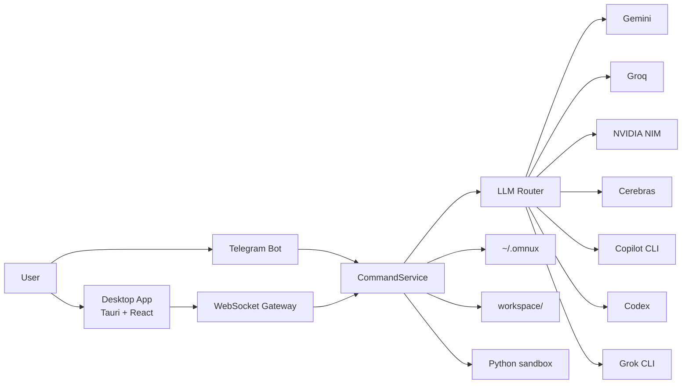

# omnux Architecture

[한국어](../아키텍처_흐름.md) · [English](./architecture.md)

Updated: 2026-09-12

omnux ties small components together with WebSocket and file-based state stores. The desktop app and the Telegram bot don't behave as separate products; both pass through the same command layer.



## Components

| Location | Tech | Role |
|---|---|---|
| `apps/omnux-middleware` | .NET 9, AOT | WebSocket/HTTP server, Telegram, routing, state persistence, metrics/guarded kill, domain orchestration |
| `apps/desktop` | Tauri v2 + React 19 + TypeScript + Tailwind CSS v4 | Desktop frontend. Zustand state, 18 screens in 6 areas, 3 themes |
| `apps/omnux-sandbox` | Python | Code execution sandbox. Memory/CPU limits, minimal env vars |
| `workspace/` | — | Build, routine, logic, and task graph artifacts |
| `~/.omnux` | JSON + Markdown | Persistent state: settings, conversations, routines, plans, notebooks |

## Request Flow

1. A request comes from the desktop app or Telegram.
2. The WebSocket Gateway or Telegram loop hands it to the same CommandService.
3. CommandService dispatches through SlashCommandRouter to domain handlers.
4. Handlers delegate to their domain's ApplicationService.
5. If an LLM is needed, LlmRouter picks the provider and fallback chain.
6. Results land in conversation history, execution folders, runtime logs, and notebook documents.

## Command Routing Layer

`PublishAot=true` rules out reflection-based DI, so handlers are assembled by hand in `Program.cs`.

```
ExecuteNormalizedCommandRoutingAsync (router)
  → SlashCommandRouter.TryHandleAsync(ctx)
      → StaticSlashCommandHandler       (static help/usage)
      → CoreRuntimeSlashCommandHandler  (/metrics, /kill)
      → DoctorSlashCommandHandler
      → NotebookSlashCommandHandler
      → HandoffSlashCommandHandler
      → PlanSlashCommandHandler
      → TaskSlashCommandHandler
      → MemorySlashCommandHandler
      → ChannelSettingsSlashCommandHandler (/talk, /code, /profile, /mode, ...)
      → LlmControlSlashCommandHandler     (/llm)
      → RoutineSlashCommandHandler
      → CodingSlashCommandHandler
  → (miss) non-slash natural language / Telegram chat/intent fallback
```

Each handler depends only on its own domain ApplicationService, not on CommandService private state.

### ApplicationService

Domain services live in `src/Application/`.

| Domain | Service | Role |
|---|---|---|
| Coding | `CodingApplicationService` (partial) | Single/orchestration/multi runs, validation, profiles |
| Routines | `RoutineApplicationService` (partial) | Creation, execution, scheduler, validation |
| Conversations | `ConversationApplicationService` | CRUD, backup, compression |
| Memory | `MemoryApplicationService` | Note CRUD, search |
| LLM control | `LlmControlApplicationService`, `LlmSettingsApplicationService` | Model/provider switching |
| Doctor | `DoctorApplicationService` | Environment diagnostics, fix preview |
| Plans / Task graph | `PlanApplicationService`, `TaskGraphApplicationService` | Plan create/review/approve/run, graph execution |
| Notebooks | `NotebookApplicationService` | Learnings/decisions/verification/handoff |
| Refactoring | `RefactorApplicationService` | Safe Refactor |
| Projects | `ProjectApplicationService` | Project CRUD |
| Agent comms | `AgentCommunicationApplicationService` | Messages/board/lifecycle |
| Others | Telemetry, GitAutomation, SessionReplay, SemanticSearch, Mcp, Terminal, Rag, LocalLlm, ClipboardVision, and more |

### WebSocket Dispatchers

`Ws*CommandDispatcher` (30 files) handle domain-specific WebSocket commands. Every desktop request passes through this layer.

### Policy Classes

`CommandService` and `LlmRouter` are entry points only. Decisions, parsing, and prompt assembly live in unit-testable policy classes.

- Search: `SearchQueryPolicy`, `SearchUrlContextPolicy`, `SearchPromptPolicy`, `SearchAnswerFormatterPolicy`
- Coding: `CodingLanguagePolicy`, `CodingPromptPolicy`, `CodingFallbackPolicy`, `CodingExecutionSafetyPolicy`, `CodingTaskSignalPolicy`
- Chat/Telegram: `ChatRetryGuardPolicy`, `AssistantReplyPolicy`, `TelegramNaturalCommandPolicy`, `TelegramResponseFormatterPolicy`
- Routines/Logic: `RoutineSchedulePolicy`, `LogicGraphValidationPolicy`, `LogicTemplateResolver`, `LogicLeafNodeExecutor`
- Providers: `OpenAiCompatibleProtocol`, `ProviderResponseParser`, `GeminiCitationParser`, `GroqRateLimitHeaderParser`, `ProviderTimeoutPolicy`
- Others: `RemoteLimitedMessagePolicy`, `UniversalCodeExecutionSafetyPolicy`, `AdaptiveContextCompressionPolicy`, `PromptCachePolicy`, `RagRetrievalPreflightPolicy`, `MemoryTierPolicy`

Policies have unit tests in `apps/omnux-middleware-tests`, and `scripts/check-security-boundaries.mjs` verifies the contracts.

## Desktop Frontend

```
src/
  App.tsx                   — Screen registry
  shell-store.ts            — Shell global state (auth, connection, logs)
  middleware-contract.ts    — Middleware port / WS address contract
  use-middleware-session.ts — WS session bridge
  features/
    shell/                  — Rail, sub-panel, top bar, command palette, area map (nav-areas.ts)
    middleware/             — desktop-message-gateway and other WS gateway helpers
    chat-workspace/         — Ask
    build-workspace/        — Build
    automation-workspace/   — Automate
    explore-workspace/      — Explore
    task-workspace/         — Tasks
    ...                     — Per-screen directories
  components/               — ui/primitives, screen, capsule
```

1. React opens a `ws://127.0.0.1:41880/ws/` session through `use-middleware-session`.
2. Server messages are dispatched to screen stores through `desktop-message-gateway`.
3. Screens hand UI input to the gateway; field-name translation and the request allow-list live there. No business logic.

Design rules:

- Tailwind CSS v4 semantic tokens, 3 themes: Light (default), Glass, Dark
- No `window.alert/confirm/prompt`; use the custom Dialog
- No `dangerouslySetInnerHTML`; use `react-markdown`

### Desktop Shell Boundary

The Tauri Rust shell owns only the app shell.

- Allowed: window management, autostart, media info, .NET middleware bootstrap (`dotnet run` in dev, sidecar in release)
- Forbidden: LLM, coding, routines, refactoring, logic, routing, direct `~/.omnux` access, direct provider/API calls

## Security Boundaries

- Secrets are split across environment variables, `*_FILE` paths, the secure store (`~/.config/omnux/secrets.json`, 0600), and the macOS Keychain.
- Remote clients enter limited mode without OTP, but still pass a WebSocket message allowlist.
- WebSocket enforces Origin checks, a pre-auth message allowlist, command rate limits, and a default 16MB message cap.
- `/api/local-image` allows only routine asset paths. Attachments over the count/size limits are rejected.
- Static files served by the middleware are returned byte-for-byte, with `304 Not Modified` for `ETag`/`Last-Modified` conditional requests.
- Markdown rendering disables raw HTML.
- Safe Refactor re-checks file state right before apply. Coding runs support workspace rollback.
- JSON state writes take a per-file `.lock` lease and replace atomically. The previous valid file is kept as `.bak`.
- Coding runs get their own folder, and local code execution is allowed only when `OMNUX_ENABLE_DYNAMIC_CODE=true`. The shell is picked as zsh → bash → sh, whichever exists.
- The Python sandbox limits local trusted code; it is not an OS-level security sandbox.

## Remote Limited Mode Permissions

| Category | Status | Details |
|---|---|---|
| Read features | Allowed | Settings state, conversation list/detail, memory note list/read/search, context/skills/commands lists, notebooks, project list |
| Models/routing | Partly allowed | Routing policy get/save/reset, last routing decision, model list, model selection |
| Work execution | Blocked | Chat/coding/routine/logic graph execution, task graph execution, refactor apply, tool execution |
| Auth | Blocked | OTP request, stored auth-token resume, Copilot/Codex CLI auth status, login, logout |
| Secret settings | Blocked | Telegram credential save/delete/test, LLM API key save/delete |
| External access settings | Blocked | External-access toggle changes |
