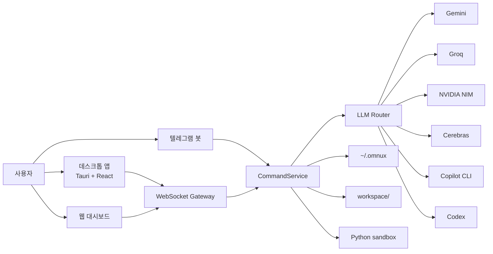

# omnux 아키텍처

[한국어](./아키텍처_흐름.md) · [English](./en/architecture.md)

업데이트 기준: 2026-06-05

omnux는 작게 나눈 구성요소를 WebSocket과 파일 상태 저장소로 묶는다. 핵심은 데스크톱 앱, 웹 대시보드, 텔레그램 봇이 서로 다른 제품처럼 동작하지 않고, 같은 명령 계층을 통과한다는 점이다.



## 구성요소

| 위치 | 기술 | 역할 |
|---|---|---|
| `apps/omnux-middleware` | .NET 9, AOT | WebSocket/HTTP 서버, 텔레그램, 라우팅, 상태 저장, metrics/guarded kill, 도메인 오케스트레이션 |
| `apps/desktop` | Tauri v2 + React 19 + TypeScript + Tailwind CSS v4 | 데스크톱 프론트엔드. Zustand 상태관리, 10개 핵심 화면, 3-tier 테마 |
| `apps/omnux-dashboard` | HTML/CSS/JavaScript | 정적 웹 대시보드(레거시). Phase 5 이전 기본 인터페이스 |
| `apps/omnux-sandbox` | Python | 코드 실행 샌드박스. 메모리/CPU 제한, 최소 환경변수 |
| `workspace/` | — | 코딩, 루틴, 로직, task graph 산출물 |
| `~/.omnux` | JSON + Markdown | 설정, 대화, 루틴, 계획, 노트북 등 영속 상태 |

## 요청 흐름

1. 데스크톱, 웹 대시보드, 또는 텔레그램에서 요청을 보낸다.
2. WebSocket Gateway나 Telegram loop가 같은 CommandService로 넘긴다.
3. CommandService가 SlashCommandRouter를 통해 도메인 핸들러로 분기한다.
4. 핸들러는 해당 도메인의 ApplicationService에 위임한다.
5. LLM이 필요하면 LlmRouter가 provider와 fallback chain을 선택한다.
6. 결과는 대화 기록, 실행 폴더, runtime 로그, notebook 문서에 남는다.

## 내부 구조: 명령 라우팅 계층

### SlashCommandRouter (AOT-safe)

`PublishAot=true` 환경에서 리플렉션 기반 DI를 쓸 수 없으므로, `Program.cs`에서 핸들러를 수동으로 조립한다.

```
ExecuteNormalizedCommandRoutingAsync (라우터)
  → SlashCommandRouter.TryHandleAsync(ctx)
      → StaticSlashCommandHandler       (정적 help/usage)
      → CoreRuntimeSlashCommandHandler  (/metrics, /kill)
      → DoctorSlashCommandHandler       (의존: IDoctorApplicationService)
      → NotebookSlashCommandHandler     (의존: INotebookApplicationService)
      → HandoffSlashCommandHandler
      → PlanSlashCommandHandler
      → TaskSlashCommandHandler
      → MemorySlashCommandHandler
      → ChannelSettingsSlashCommandHandler (/talk, /code, /profile, /mode 등)
      → LlmControlSlashCommandHandler     (/llm)
      → RoutineSlashCommandHandler        (의존: IRoutineApplicationService)
      → CodingSlashCommandHandler         (의존: ICodingApplicationService)
  → (miss) 비슬래시 자연어/텔레그램 chat/intent fallback
```

각 핸들러는 CommandService private state에 의존하지 않고, 자기 도메인 ApplicationService만 의존한다.

### ApplicationService 계층

`src/Application/` (75개 파일)에 도메인 서비스가 있다.

| 도메인 | 서비스 | 역할 |
|---|---|---|
| 코딩 | `CodingApplicationService` (12 partial) | 단일/오케스트레이션/멀티 실행, 검증, 프로필 |
| 루틴 | `RoutineApplicationService` (14 partial) | 생성, 실행, 스케줄러, 생성 전략, 검증 |
| 대화 | `ConversationApplicationService` | CRUD, 백업, 압축 |
| 메모리 | `MemoryApplicationService` | 노트 CRUD, 검색 |
| LLM 제어 | `LlmControlApplicationService`, `LlmSettingsApplicationService` | 모델/프로바이더 전환 |
| Doctor | `DoctorApplicationService` | 환경 진단, fix preview/apply |
| 계획 | `PlanApplicationService` | 계획 생성/리뷰/승인/실행 |
| Task Graph | `TaskGraphApplicationService` | 그래프 실행/상태 |
| 노트북 | `NotebookApplicationService` | 학습/결정/검증/handoff |
| 리팩터 | `RefactorApplicationService` | Safe Refactor |
| 프로젝트 | `ProjectApplicationService` | 프로젝트 CRUD |
| 에이전트 통신 | `AgentCommunicationApplicationService` | 메시지/보드/생명주기 |
| Telemetry | `TelemetryApplicationService` | LLM 호출 추적 |
| Git 자동화 | `GitAutomationApplicationService` | snapshot, preview/apply |
| 세션 리플레이 | `SessionReplayApplicationService` | 타임라인 재생 |
| 기타 | SemanticSearch, Mcp, Terminal, Rag, GitTimeMachine, SelfImprovement, CommitLearning, LocalLlm, ClipboardVision 등 |

### WebSocket Dispatcher 계층

`Ws*CommandDispatcher` (30개)가 각 도메인별 WebSocket 명령을 처리한다. 웹 대시보드와 데스크톱 앱의 모든 요청이 이 계층을 통과한다.

### 정책(Policy) 클래스

`CommandService`와 `LlmRouter`는 진입점이자 orchestrator 역할만 맡고, 순수 판정·파싱·프롬프트 조립 로직은 단위 테스트 가능한 정책 클래스로 분리되어 있다.

- 검색: `SearchQueryPolicy`, `SearchUrlContextPolicy`, `SearchPromptPolicy`, `SearchAnswerFormatterPolicy`
- 코딩: `CodingLanguagePolicy`, `CodingPromptPolicy`, `CodingFallbackPolicy`, `CodingExecutionSafetyPolicy`, `CodingWorkerSelectionPolicy`
- 대화/텔레그램: `ChatRetryGuardPolicy`, `TelegramNaturalCommandPolicy`, `TelegramResponseFormatterPolicy`
- 루틴/로직: `RoutineSchedulePolicy`, `LogicGraphValidationPolicy`, `LogicTemplateResolver`, `LogicLeafNodeExecutor`
- provider: `OpenAiCompatibleProtocol`, `ProviderResponseParser`, `GeminiCitationParser`, `GroqRateLimitHeaderParser`, `ProviderTimeoutPolicy`
- 자연어: `NaturalCommandValidationPolicy`, `NaturalCommandInterpretationPolicy`, `NaturalCommandDeterministicPolicy`
- 기타: `RemoteLimitedMessagePolicy`, `UniversalCodeExecutionSafetyPolicy`, `AdaptiveContextCompressionPolicy`, `PromptCachePolicy`, `ModelRoutingReadinessPolicy`, `RagRetrievalPreflightPolicy`, `MemoryTierPolicy`

각 정책은 `apps/omnux-middleware-tests`에 단위 테스트가 있고, `scripts/check-security-boundaries.mjs`가 계약을 검증한다.

## 데스크톱 프론트엔드 아키텍처

### 구조

```
src/
  App.tsx              — 페이지 레지스트리/라우팅
  shell-store.ts       — 셸 전역 상태 (인증, 연결, 로그)
  ShellErrorBoundary   — 전체 렌더 실패 시 fallback
  CardBoundary         — 카드별 렌더 실패 격리
  features/            — 24개 도메인별 디렉터리
    ask/               — 대화 (store + page + gateway)
    build/             — 코딩 실행
    logic/             — 로직 그래프
    explore/           — 웹 검색, 세션, browser/canvas
    automate/          — 루틴 CRUD + 생성 wizard
    ...                — 각 도메인마다 동일 구조
  middleware-contract.ts — WS 타입 계약
  use-middleware-session.ts — WS 세션 브릿지
  desktop-message-gateway.ts — 페이지별 WS 라우팅
```

### 통신 구조

1. 데스크톱 React가 `use-middleware-session`으로 미들웨어 WebSocket 세션을 연다.
2. 서버 메시지는 `desktop-message-gateway`를 통해 각 페이지 store로 배포된다.
3. 페이지는 UI 입력만 gateway에 넘기고, 미들웨어 필드명 변환은 gateway가 담당한다.
4. 허용 요청 allow-list와 payload 번역만 맡고, 비즈니스 로직은 없다.

### 디자인 시스템

- Tailwind CSS v4 + shadcn/ui 스타일 토큰
- 3-tier 테마: Glass (기본, 반투명+blur), Light (오프화이트+그림자), Dark (warm dark+glow)
- 프리미티브: `src/components/ui/primitives.tsx` (Button, Card, Badge, Input, Textarea, EmptyState, Spinner)
- `window.alert/confirm/prompt` 금지, 커스텀 Dialog 사용
- `dangerouslySetInnerHTML` 금지, `react-markdown` 사용
- 인라인 스타일 금지, Tailwind 클래스만 사용

### 데스크톱 셸 경계

Tauri Rust 백엔드는 앱 셸(Window 관리)만 담당한다.

- 허용: window 생성/닫기, deep link, open external, .NET 미들웨어 sidecar bootstrap
- 금지: LLM, 코딩, 루틴, 리팩터, 로직, 라우팅, `~/.omnux` 직접 접근, provider/API 직접 호출

## 안전 경계

- 시크릿은 환경변수, `*_FILE`, secure store, Keychain 경로로 분리한다.
- 외부접속 클라이언트는 OTP 요청 없이 제한 모드로 자동 승인되지만, WebSocket 메시지 allowlist를 한 번 더 통과해야 한다. 읽기 중심 상태 조회만 허용하고 대화/코딩/루틴/로직 그래프 실행 같은 작업 실행 액션은 차단된다.
- WebSocket은 Origin 검사, 인증 전 메시지 allowlist, 명령 rate limit, 기본 16MB 메시지 상한을 적용한다.
- `/api/local-image`는 루틴 자산 경로만 허용하고, 첨부는 개수/크기 한도를 넘으면 거부한다.
- 대시보드 정적 파일은 바이트 그대로 응답하고, `ETag`/`Last-Modified` 기반 조건부 요청에서는 `304 Not Modified`를 반환한다.
- Markdown 렌더링은 raw HTML을 비활성화하고 안전 fallback을 사용한다.
- Safe Refactor는 preview 생성 후 apply 직전에 파일 상태를 다시 확인한다. 코딩 실행도 workspace rollback을 지원한다.
- JSON 상태 파일 쓰기는 파일별 `.lock` lease를 잡고 원자 교체한다. 기존 정상 파일은 `.bak`로 남기며, 손상된 JSON을 읽으면 백업을 검증해 복구를 시도한다.
- 시작 시 memory index sync는 실패해도 미들웨어 기동을 막지 않는다.
- 코딩 실행은 실행별 폴더를 따로 만들고, `OMNUX_ENABLE_DYNAMIC_CODE=true`일 때만 로컬 코드 실행을 허용한다.
- Python sandbox는 로컬 신뢰 코드 실행용 제한기이며, OS 수준 보안 샌드박스는 아니다.
- 에이전트 스폰은 JSON 큐 + 토큰 버킷 + 브레이커 + 비용 캡으로 보호된다.

## 외부접속 제한 모드 권한표

외부접속 클라이언트는 로컬에서 한 번 켜 둔 LAN 접속을 통해 들어온다. 이 경로에서는 OTP 요청을 시도하지 않고 제한 모드로 자동 진입한다.

| 구분 | 상태 | 내용 |
|---|---|---|
| 읽기 기능 | 허용 | 설정 상태 조회, 대화 목록/상세 조회, 메모리 노트 목록/읽기/검색, context/skills/commands 목록, 노트북 조회, 프로젝트 목록 |
| 모델/라우팅 | 부분 허용 | 라우팅 정책 조회/저장/초기화, 마지막 라우팅 결정 조회, 모델 목록 조회, 모델 선택 |
| 작업 실행 | 차단 | 대화/코딩/루틴/로직 그래프 실행, 작업 그래프 실행, 리팩터 적용, 도구 실행 |
| 인증 | 차단 | OTP 요청, 저장된 인증 토큰 재개, Copilot/Codex CLI 인증 상태 조회, 로그인, 로그아웃 |
| 시크릿 설정 | 차단 | Telegram 자격 증명 저장/삭제/테스트, LLM API 키 저장/삭제 |
| 외부접속 설정 | 차단 | 외부접속 토글 변경 |
