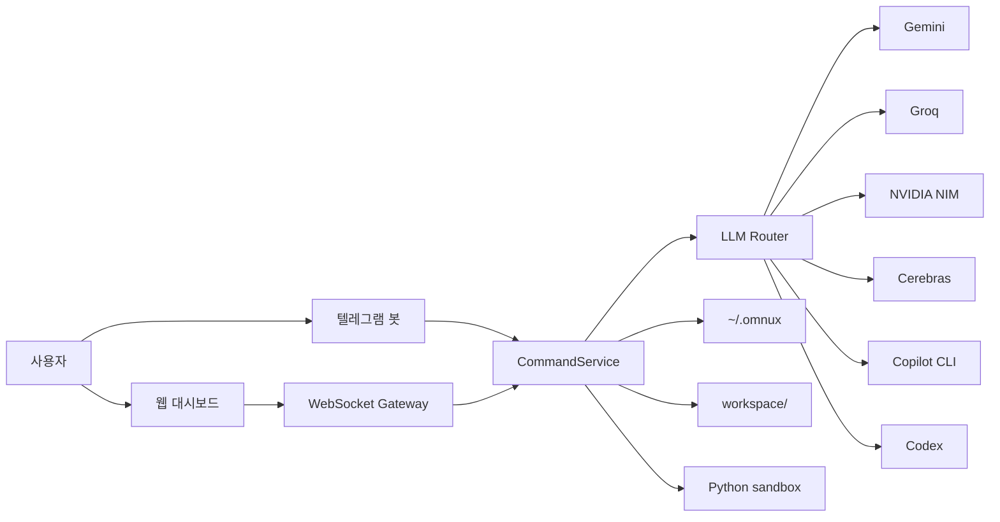

# omnux 아키텍처

[한국어](./아키텍처_흐름.md) · [English](./en/architecture.md)

업데이트 기준: 2026-05-21

omnux는 작게 나눈 구성요소를 WebSocket과 파일 상태 저장소로 묶는다. 핵심은 웹 대시보드와 텔레그램 봇이 서로 다른 제품처럼 동작하지 않고, 같은 명령 계층을 통과한다는 점이다.

## 구성요소

| 위치 | 역할 |
|---|---|
| `apps/omnux-middleware` | .NET 9 서버, WebSocket/HTTP, 텔레그램, 라우팅, 상태 저장, metrics/guarded kill |
| `apps/omnux-dashboard` | 정적 웹 대시보드 |
| `apps/omnux-sandbox` | 코드 실행 샌드박스 |
| `workspace/` | 코딩, 루틴, 로직, task graph 산출물 |
| `~/.omnux` | 설정, 대화, 루틴, 계획, 노트북 등 영속 상태 |

## 요청 흐름

1. 대시보드 또는 텔레그램에서 요청을 보낸다.
2. WebSocket Gateway나 Telegram loop가 같은 CommandService로 넘긴다.
3. CommandService가 대화, 코딩, 루틴, 계획, refactor 같은 도메인으로 분기한다.
4. LLM이 필요하면 LlmRouter가 provider와 fallback chain을 선택한다.
5. 결과는 대화 기록, 실행 폴더, runtime 로그, notebook 문서에 남는다.

## 내부 구조: 정책 계층 분리

`CommandService`와 `LlmRouter`는 진입점이자 orchestrator 역할만 맡고, 순수 판정·파싱·프롬프트 조립 로직은 단위 테스트 가능한 정책(policy)·파서(parser)·리졸버(resolver) 클래스로 분리되어 있다. 인스턴스 상태와 외부 서비스(LLM 호출, 파일 IO, 대화 저장소)에 의존하는 부분만 orchestrator에 남는다.

대표 분리 클래스:

- 검색: `SearchQueryPolicy`, `SearchUrlContextPolicy`, `SearchPromptPolicy`, `SearchAnswerFormatterPolicy`, `GitHubRepositoryContextLoader`
- 코딩: `CodingLanguagePolicy`, `CodingPromptPolicy`, `CodingFallbackPolicy`, `CodingExecutionSafetyPolicy`, `CodingWorkerSelectionPolicy`, `CodingOrchestrationPromptPolicy`, `CodingLoopActionExecutor`, `CodingLoopPlanParser`
- 대화/텔레그램: `ChatRetryGuardPolicy`, `LocalAssistantQuestionPolicy`, `ConversationContextPolicy`, `ChatOutputSanitizerPolicy`, `TelegramLlmControlCommandParser`, `TelegramNaturalCommandPolicy`, `TelegramResponseFormatterPolicy`, `TelegramPseudoCommandExecutor`
- 루틴/로직 그래프: `RoutineSchedulePolicy`, `LogicGraphValidationPolicy`, `LogicValueParsingPolicy`, `LogicNodeRuntimePolicy`, `LogicTemplateResolver`, `LogicLeafNodeExecutor`
- provider: `OpenAiCompatibleProtocol`, `ProviderResponseParser`, `GeminiCitationParser`, `GroqRateLimitHeaderParser`, `ProviderTimeoutPolicy`, `PlanningPromptPolicy`, 각 provider별 chat/streaming adapter

각 정책은 `apps/omnux-middleware-tests`에 단위 테스트가 있고, `scripts/check-security-boundaries.mjs`가 "정책이 책임을 소유하고 CommandService/LlmRouter는 위임만 한다"는 계약을 소스 문자열 기준으로 검증한다.

## 안전 경계

- 시크릿은 환경변수, `*_FILE`, secure store, Keychain 경로로 분리한다.
- 외부접속 클라이언트는 OTP 요청 없이 제한 모드로 자동 승인되지만, WebSocket 메시지 allowlist를 한 번 더 통과해야 한다. 읽기 중심 상태 조회만 허용하고 대화/코딩/루틴/로직 그래프 실행 같은 작업 실행 액션은 차단된다.
- WebSocket은 Origin 검사, 인증 전 메시지 allowlist, 명령 rate limit, 기본 16MB 메시지 상한을 적용한다. 더 큰 payload는 거부한다. Origin이 없는 WebSocket 요청은 로컬 loopback에서만 허용하고 외부 접속에서는 거부한다.
- `/api/local-image`는 루틴 자산 경로만 허용하고, 첨부는 개수/크기 한도를 넘으면 잘라내지 않고 거부한다.
- 대시보드 정적 파일은 바이트 그대로 응답하고, `ETag`/`Last-Modified` 기반 조건부 요청에서는 `304 Not Modified`를 반환한다. `Cache-Control: no-cache`로 매 요청 재검증을 유지해 개발 중 파일 변경 반영이 깨지지 않게 한다.
- Markdown 렌더링은 raw HTML을 비활성화하고 안전 fallback을 사용한다.
- Safe Refactor는 preview 생성 후 apply 직전에 파일 상태를 다시 확인한다.
- JSON 상태 파일 쓰기는 파일별 `.lock` lease를 잡고 원자 교체한다. 기존 정상 파일은 `.bak`로 남기며, 대화/세션/루틴/라우팅 정책/계획/task graph/텔레그램 outbox/guard retry timeline/usage 계열 상태는 손상된 JSON을 읽으면 백업을 검증해 복구를 시도한다. `doctor --json`의 workspace 체크는 상태 JSON, 백업, lock, 손상 JSON 개수와 손상 파일별 백업 존재 여부를 노출한다.
- 시작 시 memory index sync는 실패해도 미들웨어 기동을 막지 않는다. sync 로그와 수동 rebuild 결과에는 전체 문서 수, memory/session/project source별 문서 수, indexed/skipped/removed 수, elapsedMs를 남긴다.
- 코딩 실행은 실행별 폴더를 따로 만들고, 생성 파일과 검증 명령을 남긴다. 명시적 로컬 코드 실행은 `OMNUX_ENABLE_DYNAMIC_CODE=true`일 때만 허용한다. 실행 중 누락 의존성 자동 설치는 기본 비활성이고 `OMNUX_ENABLE_AUTO_INSTALL=true`일 때만 동작한다.
- Python sandbox는 로컬 신뢰 코드 실행용 제한기이며, 파일시스템/네트워크/환경변수 격리를 제공하는 보안 샌드박스는 아니다.
- C 코어 IPC는 `get_metrics`, `kill <pid>` 고정 line protocol만 받는다. `kill`은 미들웨어의 allowlist 검증을 통과한 뒤에만 코어로 전달한다.

## 외부접속 제한 모드 권한표

외부접속 클라이언트는 로컬에서 한 번 켜 둔 LAN 접속을 통해 들어온다. 이 경로에서는 OTP 요청을 시도하지 않고 제한 모드로 자동 진입한다.

| 구분 | 상태 | 내용 |
|---|---|---|
| 읽기 기능 | 허용 | 설정 상태 조회, 대화 목록/상세 조회, 메모리 노트 목록/읽기/검색, context/skills/commands 목록, 노트북 조회 |
| 모델/라우팅 | 부분 허용 | 라우팅 정책 조회/저장/초기화, 마지막 라우팅 결정 조회, 모델 목록 조회, 모델 선택 |
| 작업 실행 | 차단 | 대화/코딩/루틴/로직 그래프 실행, 작업 그래프 실행, 리팩터 적용, 도구 실행 |
| 인증 | 차단 | OTP 요청, 저장된 인증 토큰 재개, Copilot/Codex CLI 인증 상태 조회, 로그인, 로그아웃 |
| 시크릿 설정 | 차단 | Telegram 자격 증명 저장/삭제/테스트, LLM API 키 저장/삭제 |
| 외부접속 설정 | 차단 | 외부접속 토글 변경 |
