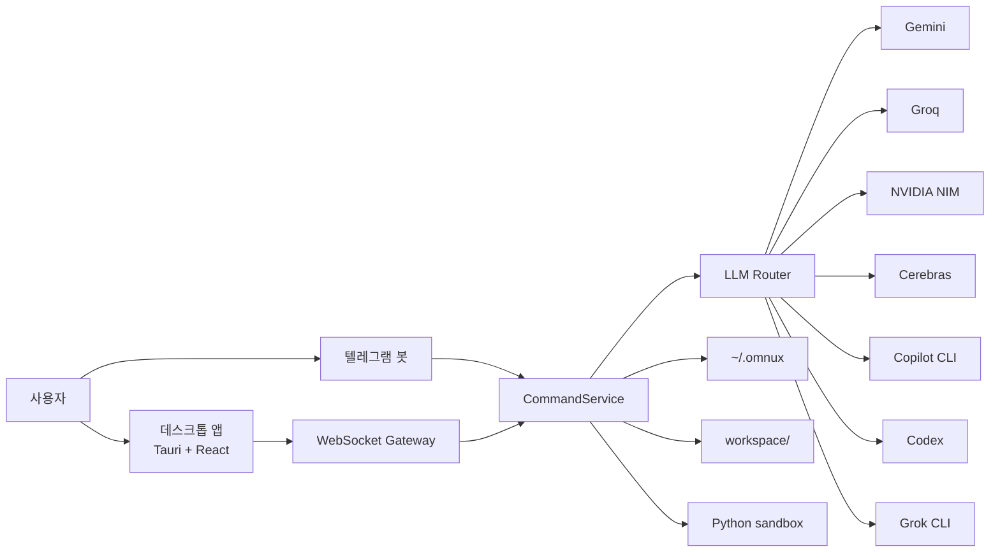

# 아키텍처

[한국어](./아키텍처_흐름.md) · [English](./en/architecture.md)

업데이트 기준: 2026-09-12

구성요소는 WebSocket과 HTTP로 통신하고 상태를 파일에 저장합니다. 데스크톱 앱과 텔레그램 봇은 동일한 명령 계층(`CommandService`)을 통과해 일관된 기능을 수행합니다.



## 구성요소

| 위치 | 기술 | 역할 |
|---|---|---|
| `apps/omnux-middleware` | .NET 9, AOT | WebSocket/HTTP 서버, 텔레그램, 라우팅, 상태 저장, metrics, guarded kill, 도메인 오케스트레이션 |
| `apps/desktop` | Tauri v2 + React 19 + TypeScript + Tailwind CSS v4 | 데스크톱 프런트엔드. Zustand 상태관리, 6개 영역 18개 화면, 3가지 테마 |
| `apps/omnux-sandbox` | Python | 코드 실행 샌드박스. 메모리·CPU 제한, 최소 환경변수 격리 |
| `workspace/` | — | 빌드, 루틴, 로직, task graph 산출물 저장소 |
| `~/.omnux` | JSON + Markdown | 설정, 대화, 루틴, 계획, 노트북 등 영속 상태 저장소 |

## 요청 흐름

1. 데스크톱 앱(WebSocket) 또는 텔레그램 봇(Update loop)에서 요청을 전송합니다.
2. 게이트웨이 계층에서 입력을 정규화한 뒤 공용 `CommandService`로 전달합니다.
3. `CommandService`가 `SlashCommandRouter`를 통해 명령 접두사 및 인텐트를 판별하여 도메인 핸들러로 분기합니다.
4. 분기된 핸들러는 해당 도메인의 `ApplicationService`에 비즈니스 처리를 위임합니다.
5. LLM 생성이 필요한 경우 `LlmRouter`가 활성 provider와 fallback chain을 결정해 호출합니다.
6. 최종 결과는 대화 내역, 작업 실행 폴더, 런타임 로그, 노트북 파일에 구조화되어 저장됩니다.

## 명령 라우팅 계층

`PublishAot=true` 네이티브 AOT 컴파일 환경에서는 런타임 리플렉션 기반 DI 제약이 있으므로, `Program.cs`에서 명시적 의존성 주입을 통해 핸들러 파이프라인을 직접 조립합니다.

```text
ExecuteNormalizedCommandRoutingAsync (라우터)
  → SlashCommandRouter.TryHandleAsync(ctx)
      → StaticSlashCommandHandler          (정적 help/usage)
      → DoctorSlashCommandHandler
      → NotebookSlashCommandHandler
      → HandoffSlashCommandHandler
      → PlanSlashCommandHandler
      → TaskSlashCommandHandler
      → MemorySlashCommandHandler
      → ChannelSettingsSlashCommandHandler  (/talk, /code, /profile, /mode 등)
      → LlmControlSlashCommandHandler       (/llm)
      → CoreRuntimeSlashCommandHandler      (/metrics, /kill)
      → RoutineSlashCommandHandler
      → CodingSlashCommandHandler
  → (miss) 비슬래시 자연어 / 텔레그램 chat·intent fallback
```

각 핸들러는 `CommandService`의 내부 상태에 직접 접근하지 않고 자기 도메인의 `ApplicationService`에만 의존합니다.

### ApplicationService

`src/Application/`에 도메인 서비스가 있습니다.

| 도메인 | 서비스 | 역할 |
|---|---|---|
| 코딩 | `CodingApplicationService` (partial) | 싱글·오케스트레이션·멀티 실행, 검증, 프로필 |
| 루틴 | `RoutineApplicationService` (partial) | 생성, 실행, 스케줄러, 검증 |
| 대화 | `ConversationApplicationService`, `ChatApplicationService` | 대화 세션 관리, 백업, 컨텍스트 압축 |
| 메모리 | `MemoryApplicationService` | 노트 관리, 검색 |
| LLM 제어 | `LlmControlApplicationService`, `LlmSettingsApplicationService` | 모델 및 provider 전환 |
| Doctor | `DoctorApplicationService` | 시스템 환경 진단, fix preview |
| 계획 / Task Graph | `PlanApplicationService`, `TaskGraphApplicationService` | 계획 생성·리뷰·승인·실행, 그래프 실행 |
| 노트북 | `NotebookApplicationService` | 학습, 결정, 검증, handoff |
| 리팩터 | `RefactorApplicationService` | Safe Refactor |
| 확장 | `Application/Extensions/` | 훅, 플러그인, 규칙 |
| 그 외 | `Agents`, `Projects`, `Telemetry`, `GitAutomation`, `SessionReplay`, `SemanticSearch`, `Mcp`, `Terminal`, `Rag`, `LocalLlm`, `ClipboardVision` | 에이전트 통신, 프로젝트, 사용량 계측, git 자동화, 세션 재생, 의미 검색, MCP, 터미널, RAG, 로컬 모델, 클립보드 비전 |

### WebSocket Dispatcher

`Ws*CommandDispatcher` 31개가 도메인별 WebSocket 명령을 처리합니다. 데스크톱 앱의 모든 요청이 이 계층을 거칩니다.

### 정책 클래스

`CommandService`와 `LlmRouter`는 진입점만 담당하고, 비즈니스 판정·파싱·프롬프트 조립은 독립 단위 테스트가 가능한 정책 클래스로 분리합니다. 현재 `*Policy` 타입은 100개입니다.

| 분야 | 대표 정책 |
|---|---|
| 검색 | `SearchQueryPolicy`, `SearchUrlContextPolicy`, `SearchPromptPolicy`, `SearchAnswerFormatterPolicy` |
| 코딩 | `CodingLanguagePolicy`, `CodingPromptPolicy`, `CodingFallbackPolicy`, `CodingExecutionSafetyPolicy`, `CodingTaskSignalPolicy` |
| 대화·텔레그램 | `ChatRetryGuardPolicy`, `AssistantReplyPolicy`, `TelegramNaturalCommandPolicy`, `TelegramResponseFormatterPolicy` |
| 루틴·로직 | `RoutineSchedulePolicy`, `LogicGraphValidationPolicy`, `LogicTemplateResolver`, `LogicLeafNodeExecutor` |
| provider | `OpenAiCompatibleProtocol`, `ProviderResponseParser`, `GeminiCitationParser`, `ProviderRateLimitHeaderParser`, `ProviderTimeoutPolicy`, `ProviderHealthStats` |
| 그 외 | `RemoteLimitedMessagePolicy`, `UniversalCodeExecutionSafetyPolicy`, `AdaptiveContextCompressionPolicy`, `PromptCachePolicy`, `RagRetrievalPreflightPolicy`, `MemoryTierPolicy` |

정책에는 `apps/omnux-middleware-tests`의 단위 테스트가 연결되어 있으며, `scripts/check-security-boundaries.mjs`가 경계 계약을 지속 검증합니다.

## 데스크톱 프런트엔드

```text
src/
  App.tsx                   — 화면 레지스트리
  shell-store.ts            — 셸 전역 상태 (인증, 연결, 로그)
  middleware-contract.ts    — 미들웨어 포트·WS 주소 계약
  use-middleware-session.ts — WS 세션 브릿지
  features/
    shell/                  — 레일, 서브패널, 상단바, 커맨드 팔레트, 영역 정의(nav-areas.ts)
    middleware/             — desktop-message-gateway 등 WS gateway 헬퍼
    chat-workspace/         — 질문
    build-workspace/        — 빌드
    automation-workspace/   — 자동화
    explore-workspace/      — 탐색
    task-workspace/         — 작업
    ...                     — 화면별 디렉터리
  components/               — ui/primitives, screen, capsule
```

1. React가 `use-middleware-session`으로 `ws://127.0.0.1:41880/ws/` 세션을 연결합니다.
2. 서버 수신 메시지는 `desktop-message-gateway`를 거쳐 각 화면 store로 라우팅됩니다.
3. 화면은 UI 이벤트만 gateway에 전달하며, 프로토콜 직렬화와 허용 요청 목록 관리는 gateway가 전담합니다.

디자인 규칙은 다음과 같습니다.

- Tailwind CSS v4 시맨틱 토큰을 사용합니다. 테마는 Light(기본), Glass, Dark를 지원합니다.
- `window.alert`, `window.confirm`, `window.prompt` 대신 커스텀 Dialog 컴포넌트를 사용합니다.
- `dangerouslySetInnerHTML`을 배제하고 `react-markdown`으로 렌더링합니다.

### 데스크톱 셸 경계

Tauri Rust 셸은 앱 셸만 담당합니다.

- 허용: 창 관리, 자동 시작, 미디어 정보 제어, .NET 미들웨어 bootstrap (개발 모드 `dotnet run`, 배포 모드 sidecar)
- 금지: LLM 호출, 코드 생성, 루틴, 리팩터, 로직 엔진, 라우팅, `~/.omnux` 파일 직접 접근, provider API 직접 호출

## 안전 경계

- API 키 등 시크릿은 환경변수, `*_FILE`, 암호화 저장소(`~/.config/omnux/secrets.json`, 권한 0600), macOS Keychain 경로로 계층화해 관리합니다.
- 외부 접속 클라이언트는 별도 승인 없이 제한 모드로 접속하며, WebSocket 메시지 allowlist를 통해 안전하게 격리됩니다.
- WebSocket 계층은 Origin 검증, 인증 전 메시지 allowlist, 명령 요청 빈도 제한(rate limit), 기본 16MB 메시지 상한을 적용합니다.
- `/api/local-image` 엔드포인트는 루틴 에셋 경로만 허용합니다. 파일 첨부는 개수와 용량 상한 초과 시 즉시 거부합니다.
- 미들웨어가 서빙하는 정적 파일은 바이트 그대로 응답하고, `ETag`/`Last-Modified` 기반 조건부 요청에는 `304 Not Modified`를 반환합니다.
- Markdown 렌더링 시 원시 HTML(raw HTML) 태그 파싱을 비활성화합니다.
- Safe Refactor는 변경 적용 직전에 대상 파일 상태를 재검증하고 롤백 스냅샷을 생성합니다. 에이전트 스폰 작업 역시 워크스페이스 롤백 스냅샷을 자동으로 보존합니다.
- JSON 상태 파일 쓰기는 파일별 `.lock` 임대(lease)를 획득한 후 원자적 교체(atomic replace) 방식으로 수행하며, 정상 버전은 `.bak`로 백업합니다.
- 코드 생성 및 실행은 작업별로 격리된 독립 디렉터리에서 수행합니다. 로컬 코드 실행은 `OMNUX_ENABLE_DYNAMIC_CODE=true` 설정 시에만 허용되며, 시스템 셸은 zsh → bash → sh 순서로 감지해 사용합니다.
- Python sandbox는 로컬 환경의 안전한 코드 실행을 보조하는 프로세스 격리기이며, 커널 수준의 완전한 가상화 샌드박스가 아닙니다.

## 외부접속 제한 모드 권한표

| 구분 | 상태 | 내용 |
|---|---|---|
| 읽기 기능 | 허용 | 설정 상태, 대화 목록·상세, 메모리 노트 목록·읽기·검색, context/skills/commands 목록, 노트북, 프로젝트 목록 |
| 모델·라우팅 | 부분 허용 | 라우팅 정책 조회·저장·초기화, 마지막 라우팅 결정, 모델 목록, 모델 선택 |
| 작업 실행 | 차단 | 대화/코딩/루틴/로직 그래프 실행, 작업 그래프 실행, 리팩터 적용, 도구 실행 |
| 인증 | 차단 | OTP 요청, 저장된 인증 토큰 재개, Copilot·Codex CLI 인증 상태, 로그인, 로그아웃 |
| 시크릿 설정 | 차단 | Telegram 자격 증명 저장·삭제·테스트, LLM API 키 저장·삭제 |
| 외부접속 설정 | 차단 | 외부접속 토글 변경 |
