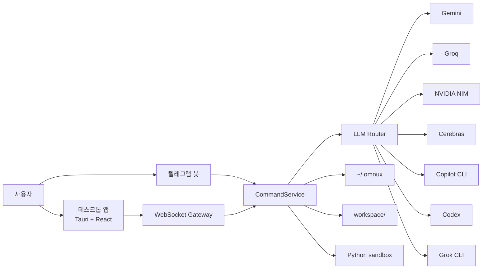

# 아키텍처

[한국어](./아키텍처_흐름.md) · [English](./en/architecture.md)

업데이트 기준: 2026-09-12

작게 나눈 구성요소를 WebSocket과 파일 상태 저장소로 묶는다. 데스크톱 앱과 텔레그램 봇은 같은 명령 계층을 통과한다.



## 구성요소

| 위치 | 기술 | 역할 |
|---|---|---|
| `apps/omnux-middleware` | .NET 9, AOT | WebSocket/HTTP 서버, 텔레그램, 라우팅, 상태 저장, metrics, guarded kill, 도메인 오케스트레이션 |
| `apps/desktop` | Tauri v2 + React 19 + TypeScript + Tailwind CSS v4 | 데스크톱 프런트엔드. Zustand 상태관리, 6개 영역 18개 화면, 3가지 테마 |
| `apps/omnux-sandbox` | Python | 코드 실행 샌드박스. 메모리·CPU 제한, 최소 환경변수 |
| `workspace/` | — | 빌드, 루틴, 로직, task graph 산출물 |
| `~/.omnux` | JSON + Markdown | 설정, 대화, 루틴, 계획, 노트북 등 영속 상태 |

## 요청 흐름

1. 데스크톱이나 텔레그램에서 요청을 보낸다.
2. WebSocket Gateway나 Telegram loop가 같은 `CommandService`로 넘긴다.
3. `CommandService`가 `SlashCommandRouter`를 통해 도메인 핸들러로 분기한다.
4. 핸들러는 해당 도메인의 ApplicationService에 위임한다.
5. LLM이 필요하면 `LlmRouter`가 provider와 fallback chain을 고른다.
6. 결과는 대화 기록, 실행 폴더, runtime 로그, notebook 문서에 남는다.

## 명령 라우팅 계층

`PublishAot=true` 환경에서는 리플렉션 기반 DI를 쓸 수 없어서 `Program.cs`가 핸들러를 직접 조립한다.

```text
ExecuteNormalizedCommandRoutingAsync (라우터)
  → SlashCommandRouter.TryHandleAsync(ctx)
      → StaticSlashCommandHandler          (정적 help/usage)
      → DoctorSlashCommandHandler
      → NotebookSlashCommandHandler
      → HandoffSlashCommandHandler
      → PlanSlashCommandHandler
      → TaskSlashCommandHandler
      → MemorySlashCommandHandler
      → ChannelSettingsSlashCommandHandler  (/talk, /code, /profile, /mode 등)
      → LlmControlSlashCommandHandler       (/llm)
      → CoreRuntimeSlashCommandHandler      (/metrics, /kill)
      → RoutineSlashCommandHandler
      → CodingSlashCommandHandler
  → (miss) 비슬래시 자연어 / 텔레그램 chat·intent fallback
```

각 핸들러는 `CommandService`의 private state 대신 자기 도메인 ApplicationService에만 의존한다.

### ApplicationService

`src/Application/`에 도메인 서비스가 있다.

| 도메인 | 서비스 | 역할 |
|---|---|---|
| 코딩 | `CodingApplicationService` (partial) | 싱글·오케스트레이션·멀티 실행, 검증, 프로필 |
| 루틴 | `RoutineApplicationService` (partial) | 생성, 실행, 스케줄러, 검증 |
| 대화 | `ConversationApplicationService`, `ChatApplicationService` | CRUD, 백업, 압축 |
| 메모리 | `MemoryApplicationService` | 노트 CRUD, 검색 |
| LLM 제어 | `LlmControlApplicationService`, `LlmSettingsApplicationService` | 모델·provider 전환 |
| Doctor | `DoctorApplicationService` | 환경 진단, fix preview |
| 계획 / Task Graph | `PlanApplicationService`, `TaskGraphApplicationService` | 계획 생성·리뷰·승인·실행, 그래프 실행 |
| 노트북 | `NotebookApplicationService` | 학습, 결정, 검증, handoff |
| 리팩터 | `RefactorApplicationService` | Safe Refactor |
| 확장 | `Application/Extensions/` | 훅, 플러그인, 규칙 |
| 그 외 | `Agents`, `Projects`, `Telemetry`, `GitAutomation`, `SessionReplay`, `SemanticSearch`, `Mcp`, `Terminal`, `Rag`, `LocalLlm`, `ClipboardVision` | 에이전트 통신, 프로젝트, 사용량 계측, git 자동화, 세션 재생, 의미 검색, MCP, 터미널, RAG, 로컬 모델, 클립보드 비전 |

### WebSocket Dispatcher

`Ws*CommandDispatcher` 31개가 도메인별 WebSocket 명령을 처리한다. 데스크톱 앱의 모든 요청이 이 계층을 지난다.

### 정책 클래스

`CommandService`와 `LlmRouter`는 진입점만 맡고, 판정·파싱·프롬프트 조립은 단위 테스트가 가능한 정책 클래스로 뺀다. 현재 `*Policy` 타입은 100개다.

| 분야 | 대표 정책 |
|---|---|
| 검색 | `SearchQueryPolicy`, `SearchUrlContextPolicy`, `SearchPromptPolicy`, `SearchAnswerFormatterPolicy` |
| 코딩 | `CodingLanguagePolicy`, `CodingPromptPolicy`, `CodingFallbackPolicy`, `CodingExecutionSafetyPolicy`, `CodingTaskSignalPolicy` |
| 대화·텔레그램 | `ChatRetryGuardPolicy`, `AssistantReplyPolicy`, `TelegramNaturalCommandPolicy`, `TelegramResponseFormatterPolicy` |
| 루틴·로직 | `RoutineSchedulePolicy`, `LogicGraphValidationPolicy`, `LogicTemplateResolver`, `LogicLeafNodeExecutor` |
| provider | `OpenAiCompatibleProtocol`, `ProviderResponseParser`, `GeminiCitationParser`, `GroqRateLimitHeaderParser`, `ProviderTimeoutPolicy` |
| 그 외 | `RemoteLimitedMessagePolicy`, `UniversalCodeExecutionSafetyPolicy`, `AdaptiveContextCompressionPolicy`, `PromptCachePolicy`, `RagRetrievalPreflightPolicy`, `MemoryTierPolicy` |

정책에는 `apps/omnux-middleware-tests`의 단위 테스트가 붙고, `scripts/check-security-boundaries.mjs`가 계약을 검증한다.

## 데스크톱 프런트엔드

```text
src/
  App.tsx                   — 화면 레지스트리
  shell-store.ts            — 셸 전역 상태 (인증, 연결, 로그)
  middleware-contract.ts    — 미들웨어 포트·WS 주소 계약
  use-middleware-session.ts — WS 세션 브릿지
  features/
    shell/                  — 레일, 서브패널, 상단바, 커맨드 팔레트, 영역 정의(nav-areas.ts)
    middleware/             — desktop-message-gateway 등 WS gateway 헬퍼
    chat-workspace/         — 질문
    build-workspace/        — 빌드
    automation-workspace/   — 자동화
    explore-workspace/      — 탐색
    task-workspace/         — 작업
    ...                     — 화면별 디렉터리
  components/               — ui/primitives, screen, capsule
```

1. React가 `use-middleware-session`으로 `ws://127.0.0.1:41880/ws/` 세션을 연다.
2. 서버 메시지는 `desktop-message-gateway`를 거쳐 화면 store로 간다.
3. 화면은 UI 입력만 gateway에 넘긴다. 필드명 변환과 허용 요청 목록은 gateway가 맡고, 화면에는 비즈니스 로직을 두지 않는다.

디자인 규칙은 이렇다.

- Tailwind CSS v4 시맨틱 토큰을 쓴다. 테마는 Light(기본), Glass, Dark 셋이다.
- `window.alert`, `window.confirm`, `window.prompt` 대신 커스텀 Dialog를 쓴다.
- `dangerouslySetInnerHTML` 대신 `react-markdown`으로 렌더링한다.

### 데스크톱 셸 경계

Tauri Rust 셸은 앱 셸만 담당한다.

- 허용: 창 관리, 자동 시작, 미디어 정보, .NET 미들웨어 bootstrap (개발 모드 `dotnet run`, 배포 모드 sidecar)
- 금지: LLM, 코딩, 루틴, 리팩터, 로직, 라우팅, `~/.omnux` 직접 접근, provider·API 직접 호출

## 안전 경계

- 시크릿은 환경변수, `*_FILE`, secure store(`~/.config/omnux/secrets.json`, 0600), macOS Keychain 경로로 나눈다.
- 외부접속 클라이언트는 OTP 요청 없이 제한 모드로 들어오고, WebSocket 메시지 allowlist를 한 번 더 통과한다.
- WebSocket은 Origin 검사, 인증 전 메시지 allowlist, 명령 rate limit, 기본 16MB 메시지 상한을 건다.
- `/api/local-image`는 루틴 자산 경로만 허용한다. 첨부는 개수·크기 한도를 넘으면 거부한다.
- 미들웨어가 서빙하는 정적 파일은 바이트 그대로 응답하고, `ETag`/`Last-Modified` 기반 조건부 요청에는 `304 Not Modified`를 반환한다.
- Markdown 렌더링은 raw HTML을 끈다.
- Safe Refactor는 apply 직전에 파일 상태를 다시 확인하고 rollback snapshot을 남긴다. 에이전트 스폰 작업도 변경이 있으면 workspace rollback snapshot을 남긴다.
- JSON 상태 파일 쓰기는 파일별 `.lock` lease를 잡고 원자 교체한다. 기존 정상 파일은 `.bak`로 남긴다.
- 코딩 실행은 실행마다 폴더를 따로 만든다. 로컬 코드 실행은 `OMNUX_ENABLE_DYNAMIC_CODE=true`일 때만 열린다. 셸은 zsh → bash → sh 순으로 있는 것을 쓴다.
- Python sandbox는 로컬 신뢰 코드용 제한기다. OS 수준 보안 샌드박스가 아니다.

## 외부접속 제한 모드 권한표

| 구분 | 상태 | 내용 |
|---|---|---|
| 읽기 기능 | 허용 | 설정 상태, 대화 목록·상세, 메모리 노트 목록·읽기·검색, context/skills/commands 목록, 노트북, 프로젝트 목록 |
| 모델·라우팅 | 부분 허용 | 라우팅 정책 조회·저장·초기화, 마지막 라우팅 결정, 모델 목록, 모델 선택 |
| 작업 실행 | 차단 | 대화/코딩/루틴/로직 그래프 실행, 작업 그래프 실행, 리팩터 적용, 도구 실행 |
| 인증 | 차단 | OTP 요청, 저장된 인증 토큰 재개, Copilot·Codex CLI 인증 상태, 로그인, 로그아웃 |
| 시크릿 설정 | 차단 | Telegram 자격 증명 저장·삭제·테스트, LLM API 키 저장·삭제 |
| 외부접속 설정 | 차단 | 외부접속 토글 변경 |
